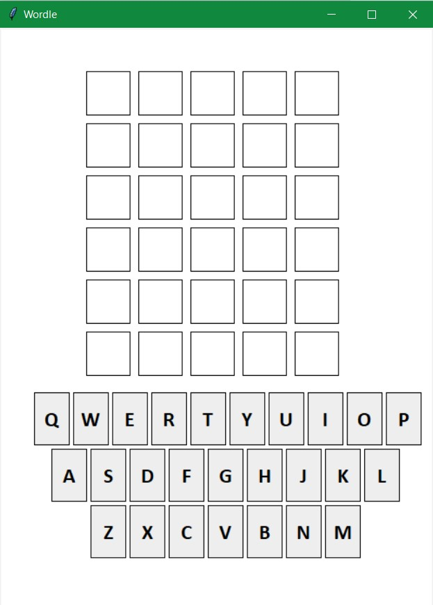

# Wordle Implementation with Python Tkinter

English Wordle implementation with Python Tkinter library. Just for fun :) 

You can play with two people, one picking the next word and the other trying to guess it. 
I will add a Turkish version and a one-person mode.

## Screenshots

